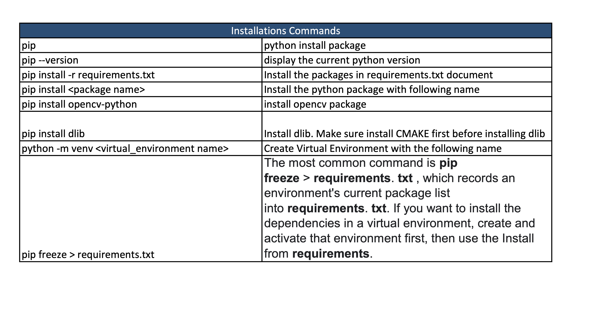

# Emotion-Recognition

Developed by : Beka Rukhaia, Giorgi Gugeshashvili, Tonmoy Chakraborty

# Overview
The primary objective of this project is to develop a prototype for an emotion recognition system implemented using Jupyter Notebook. The prototype should be capable of detecting a person's face and accurately recognizing their emotion from an image. The prototype aims to serve as a foundational demonstration for the full-scale implementation of the emotion recognition system.

This prototype focuses on implementing key machine learning functionalities, specifically emotion detection and face recognition. While the original plan aimed to deliver a complete web application using Django, constraints led to a refocused effort on the foundational/core aspects of the project.

As for today, completed: 

Machine Learning Components, such as Emotion Detection: Successfully implemented a model to recognize emotions in images. Face Recognition: Developed functionality to detect and recognize faces in images. Jupyter Notebook Implementation: Created Jupyter Notebooks (emotion_recognition.ipynb) to showcase and execute the emotion detection and face recognition algorithms.

Planned: 

Django Web App: Due to time and resource constraints, the initial plan to build a web application with Django has been deferred to a future phase.

# Implementation Work Products 

The language used to write the code is Python and you can see all the code details in this repo. Below are some of the outputs/tests which were done during the testing all the algorithms which we used for face/emotion detection.

# Outputs
These screenshots show the result of the ouput of the code, using different image processing and machine learning algorithms to identify the face and emotion of the person.
To accomplish those goals, there were used various famous techniques in machine learning and computer vision, such as: cascade classifiers for object detection, image processing with openCV library, there were used different models which we trained on the pre-provided images. Since finding and understanding ML as a whole was difficult, we used helper YouTube course, which helped to train our model for the emotion and face recognition.

# Intsructions to run the app

# Versions 
asgiref==3.4.1
joblib==1.1.0
numpy==1.21.4
opencv-python-headless==4.5.4.60
Pillow==8.4.0
pytz==2021.3
scikit-learn==1.0.1
scipy==1.7.3
sklearn==0.0
sqlparse==0.4.2
threadpoolctl==3.0.0

Clone the repository:

git clone https://github.com/bruxaia/Emotion-Recognition.git

cd Emotion-Recognition

Install the required dependencies:

pip install -r requirements.txt

It includes the following libraries: numpy, opencv-python, dlib, imutils, pandas, scikit-learn

Open jupyter notebook in your terminal and you are ready to go.

# Evaluation of Results

The implemented emotion recognition prototype demonstrated commendable accuracy in detecting facial expressions. During testing, the system exhibited efficient processing speed, providing real-time analysis of emotions in images. However, challenges were encountered in certain lighting conditions and with diverse facial expressions. Further refinement is needed to enhance performance in these scenarios. Since this is only built in 3 weeks, it is not as accurate as it should be, besides to train a model you need to have a loads of data to identify with the exact accuracy. Our model's accuracy is about 40-50%, depends on the scenario, but it is still a good achievement for such a short amount of time.

The prototype aligns well with the initial goals of creating an emotion recognition system for Jupyter Notebook. Accuracy rates were consistent with expectations, and the system's real-time processing capabilities are promising for practical applications.

# Review of Project Design

The prototype's success in meeting the intended objectives indicates that the initial design was effective. The decision to focus on real-time emotion detection in a Jupyter Notebook environment proved to be a suitable choice.

Several design decisions, such as the choice of machine learning models and integration with Jupyter Notebook, proved effective. However, the prototype testing revealed the need for additional considerations in handling diverse lighting conditions to improve overall robustness (such as more accurate RGB colors, sensors and accurators).

Based on these insights, slight adjustments to the user interface and user experience may be considered for the final implementation.

In conclusion, the prototype results affirm the viability of the initial design. Some minor adjustments will be made to address challenges identified during testing, ensuring a more robust and versatile emotion recognition system for Jupyter Notebook users. The overall positive user experience and system performance validate the effectiveness of the chosen design approach.

It may be not precisely accurate, but it is the MVP pf the product's core, which can be reitared and improved in the future.

